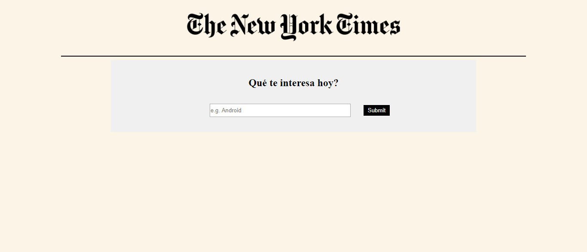
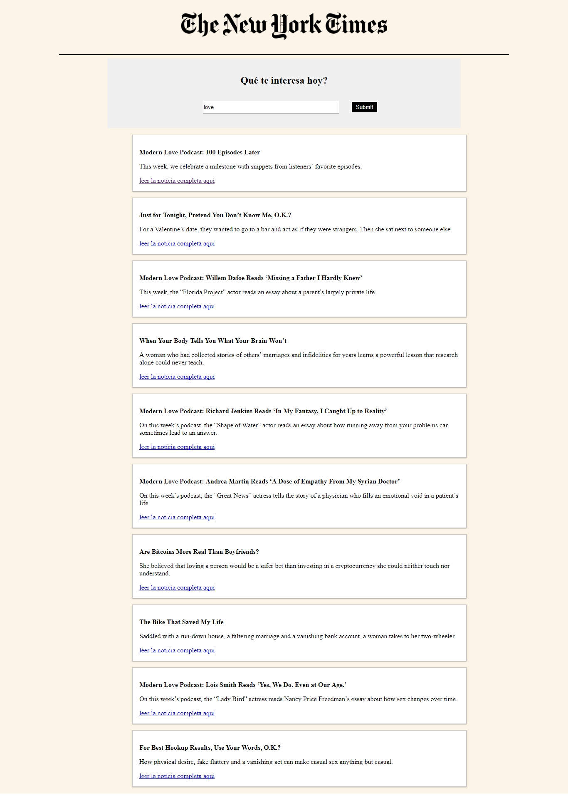

  # **API NEW YORK TIMES - XHR**

	
	</img>

  <a  href="https://travis-ci.org/t4t5/sweetalert"><a>
  

##  **OBJETIVO**

Usar XHR para construir una aplicación

## **NEW YORK TIMES API**

para la creacion de nuestra pagina Se utilizo el api del New York Times, se obtuvo la informacion con XMLHttpRequest y se creo un sevidor con express.

Nuestra pagina se visualiza asi:

.
.

##  Tecnologias Usadas
- vanilla
- javascript 
- Html5
- Api de New York Times

## Autores

- **Wendy Quispe** - [@wendytamara](https://github.com/wendytamara)

## Licencia

Este proyecto está licenciado bajo la Licencia ISC - ver el archivo [LICENSE](https://www.isc.org) para más detalles.

Copyright &copy; 2018 All Rights Reserved.
